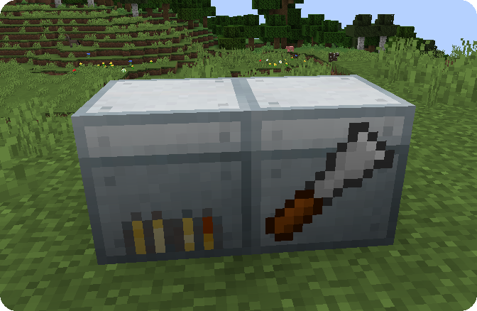
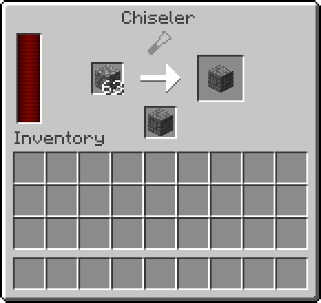
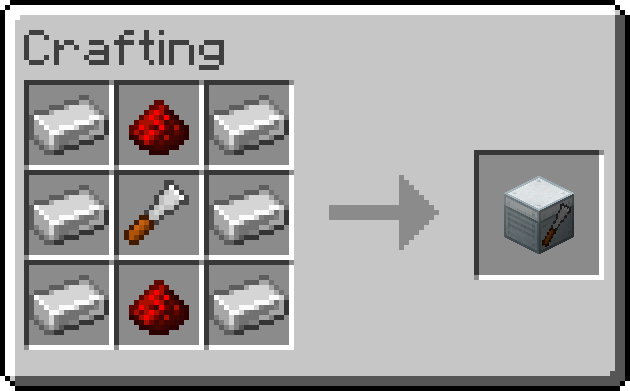

# 

## Addon for [Chisel](https://github.com/matthewperiut/chisel-reborn)
- Requires Chisel to be installed
- Lets you use energy to automate chiseling blocks!
- Energy mod required to power
- Custom GUI, given block to chisel and a template block for chiseling to, you can produce chiseled blocks at the price of power (12E / block, configurable)

## Power the Chiseler

## Chisel blocks in a custom machine GUI

## Recipe

## Use hoppers or item pipes to transfer in and out of machine
and bob's your uncle!  
(That's all)  